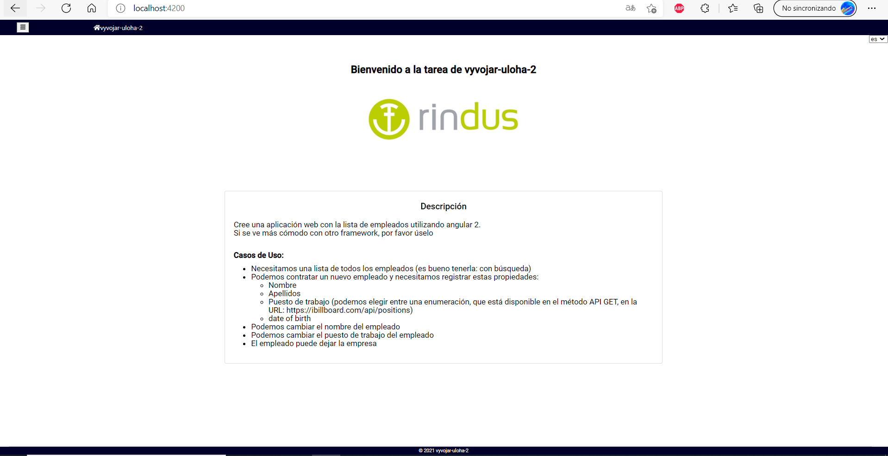
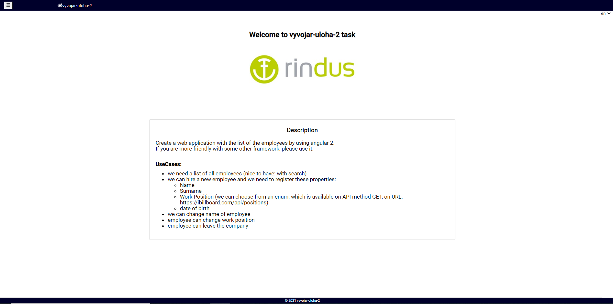
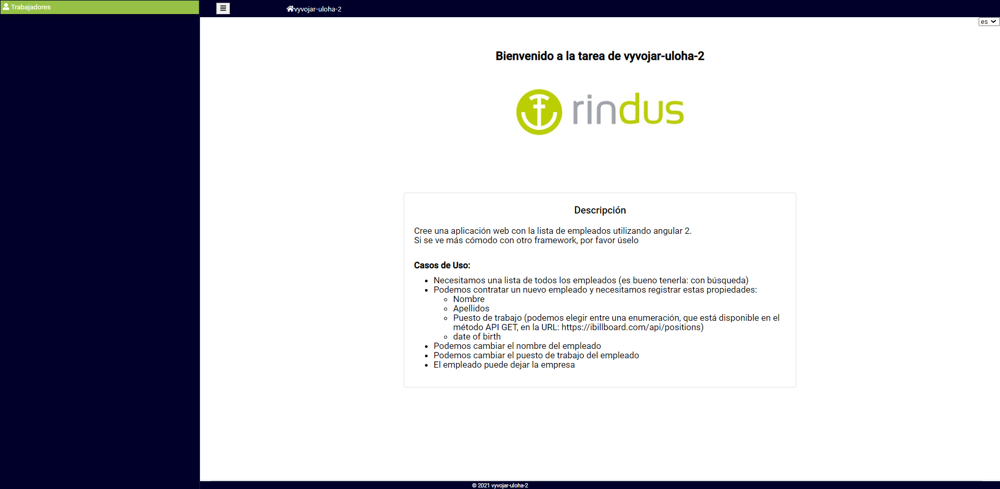
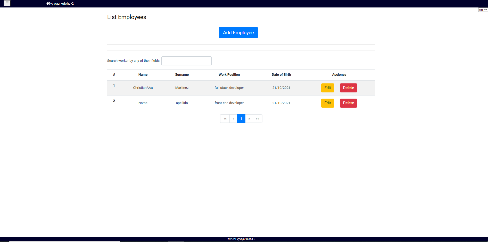
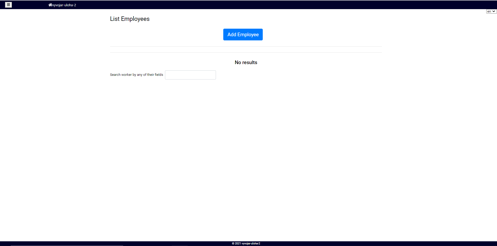
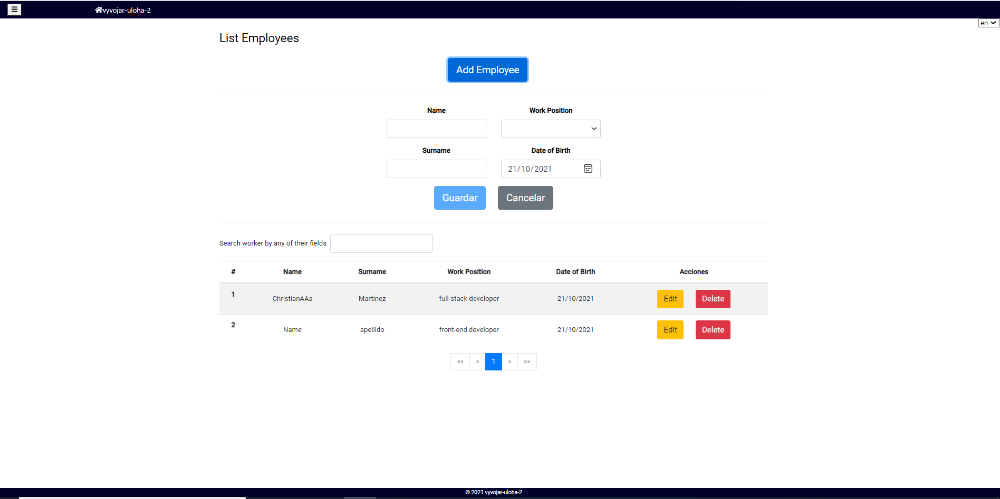
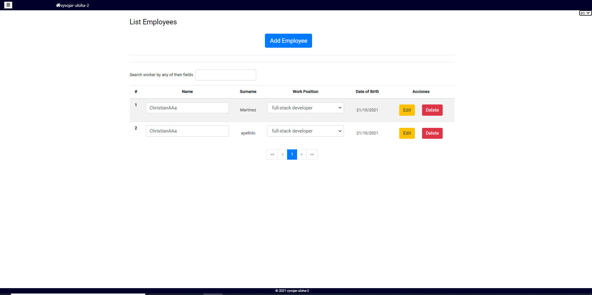
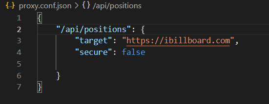
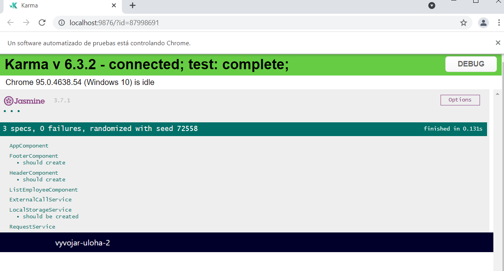
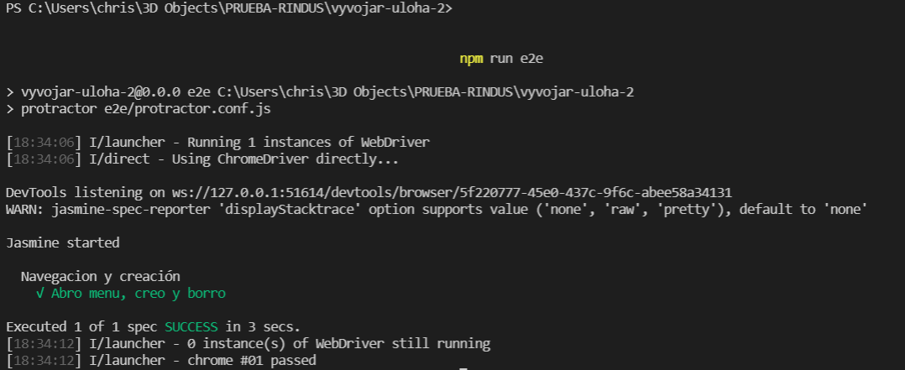

# vyvojar-uloha-2 task

This project gives a solution to the vyvojar-uloha-2 task

## Requirements
The vyvojar-uloha-2 task requirements are:

Create a web application with the list of the employees by using angular 2.

If you are more friendly with some other framework, please use it.

**UseCases:**
- we need a list of all employees (nice to have: with search)
- we can hire a new employee and we need to register these properties:
    - name
    - surname
    - work position (we can choose from an enum, which is available on API method GET, on URL: https://ibillboard.com/api/positions)
    - date of birth
- we can change name of employee
- employee can change work position
- employee can leave the company

## Notes
As we can see, this application doesnt need database, login or any complex functionality. However, we are going to use the local storage from our navigator to store the employees temporaly. 

## Solution

### Home
At first, we can see our home page. The home page has the Rindus Logo, a welcome message and the description of the task.

Besides, there are a header and footer. In the header, there is an icon which we can use to open a new lateral navigator bar. In this lateral navigator bar, we can navigate to the employees list.

Finally, on the left part of the screen, we can select the language of the application.

#### Home

#### Home English

#### Sidebar

### Employees List
The employees list has all the functionality required for this task. First, we can create a new employee pressing the add buttom and filling the form. Finally, we have to press save buttom to save the employee.

Now, we can see our new employee in the list. Also, we can delete the employee using the delete buttom and we can change his name or his work position pressing the edit buttom. Once pressed, the fields can be edited and if you press again the buttom you will save the changes.

On other hand, we can search the employees using the searcher. This searcher can find any employees by all their fields.
Besides, we can order our employees list pressing in to the column names.

#### Employees List

#### Employees Empty List

#### Form

#### Edit

#### Work Position
The work position values can be obtained in https://ibillboard.com/api/positions. To do this API GET, we create a generic call service (this service can be recycle in another projects which needs request information to others APIs). Then, we create a specific service for our request.

Altought, we need a proxy to avoid problems with this API. 

#### Proxy

## Local Deploy
### Requirements 
- "node": "14.17.0",
- "npm": "6.14.13"
- "@angular/cli": "~12.0.2",
We advice use nvm to manage node and npm versions

### How to deploy
Once installed, we have to run in a terminal the command : *npm install*

Finally, we have to use the command *npm run start* to run our application with the proxy.

### Deployed
The application can be accesed in localhost:4200

## Docker Deploy
### Requirements 
Docker must be installed

### How to deploy
First, we can change the environment variable appUrl. The value have to change from 'http://localhost:4200/' to 'http://localhost:4201/' because of docker is going to deploy our application in http://localhost:4201/

Then, we have to use the command: *docker-compose build* and finally the command *docker-compose up -d*

### Deployed
The application can be accesed in localhost:4201

## Tests
### Spec Tests
There are few spec tests in the project. This test cheks that components and services are working well
To execute this test, we only have to use *ng test* command
#### Results

### E2E Tests
E2E use protractor to test the application functionality.

First, we need deploy our aplication using *npm run start*. Then, we have to use *npm run e2e* and the tests are going to be executed

#### Results

**Note:** If you have problems to execute this test try:
- npm run node_modules/protractor/bin/webdriver-manager update
